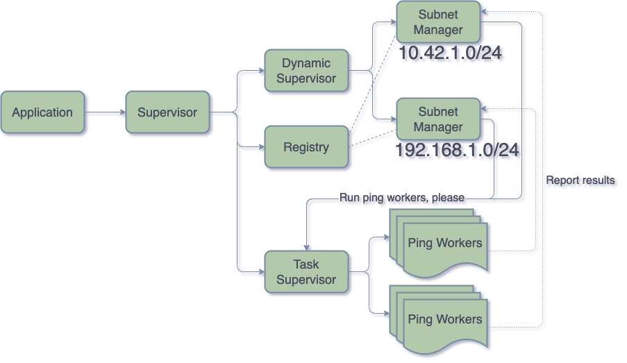

# The ping machine

The ping machine demonstrates some core Elixir and OTP programming concepts using
`Supervisors`, `GenServers` and `Tasks` to concurrently ping all hosts in a network subnet range.



**DISCLAIMER: We will not actually send any ping requests. This is trival to implement,
but beside the point of this demo. We simply sleeps for a given amount of time and
randomly choose if the "request" was successful or not.**

If you would like to read the full tutorial, it's available over at the
[{engineering@intility}](https://engineering.intility.com/article/building-a-concurrent-network-pinger-pt-1) blog!

## Running the project

Just run the project using `iex -S mix` from the project root.

```shell
$ mix deps.get
...
$ iex -S mix
iex(1)> {:ok, pid} = PingMachine.start_ping("192.168.1.0/24")
[info]  Started pinging all hosts in range 192.168.1.0/24
{:ok, #PID<0.212.0>}
[info]  Successfully pinged host 192.168.1.139
[info]  Successfully pinged host 192.168.1.254
[error] Failed to ping host 192.168.1.29
[info]  Successfully pinged host 192.168.1.21
[info]  Successfully pinged host 192.168.1.108
[error] Failed to ping host 192.168.1.119
[info]  Successfully pinged host 192.168.1.16
[error] Failed to ping host 192.168.1.109

iex(2)> PingMachine.get_successful_hosts(pid)
[ "192.168.1.84", "192.168.1.161", "192.168.1.50", "192.168.1.2",
 "192.168.1.226", "192.168.1.97", "192.168.1.186", "192.168.1.233",
 "192.168.1.72", "192.168.1.148", "192.168.1.180", "192.168.1.203",
 "192.168.1.73", "192.168.1.107", ...]

iex(3)> PingMachine.get_failed_hosts(pid)
[ "192.168.1.113", "192.168.1.24", "192.168.1.101", "192.168.1.193",
 "192.168.1.197", "192.168.1.219", "192.168.1.22", "192.168.1.165",
 "192.168.1.128", "192.168.1.155", "192.168.1.76", "192.168.1.183",
 "192.168.1.104", "192.168.1.110", "192.168.1.163", "192.168.1.156", ...]

iex(4)> PingMachine.stop_ping(pid)
:ok
```
