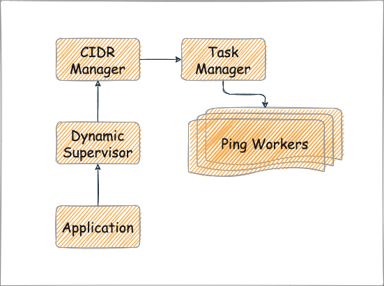

# PingMachine

Simple demo project demonstrating a few basic OTP concepts such as Supervisors,
GenServers and Tasks.



## Running the project

Just run the project using `iex -S mix` from the project root.

```shell
$ iex -S mix
iex(1)> {:ok, pid} = PingMachine.start_ping("192.168.1.0/24")

02:58:07.942 [info]  Started pinging all hosts in range 192.168.1.0/24
{:ok, #PID<0.212.0>}
 [info]  Successfully pinged host 192.168.1.143
 [error] Failed to ping host 192.168.1.144
 [info]  Successfully pinged host 192.168.1.145
 [error] Failed to ping host 192.168.1.146
 [info]  Successfully pinged host 192.168.1.147
 [error] Failed to ping host 192.168.1.155
 [info]  Successfully pinged host 192.168.1.156

iex(2)> PingMachine.get_successful_hosts pid
["192.168.1.212", "192.168.1.221", "192.168.1.18", "192.168.1.46",
 "192.168.1.25", "192.168.1.222", "192.168.1.132", "192.168.1.91",
 "192.168.1.89", "192.168.1.185", "192.168.1.39", "192.168.1.193",
 "192.168.1.47", "192.168.1.35", ...]

iex(3)> PingMachine.get_failed_hosts pid
["192.168.1.73", "192.168.1.123", "192.168.1.106", "192.168.1.196",
 "192.168.1.234", "192.168.1.202", "192.168.1.24", "192.168.1.201",
 "192.168.1.253", "192.168.1.238", "192.168.1.170", "192.168.1.146", ...]

 iex(4)> PingMachine.stop_ping pid
:ok
  ```
